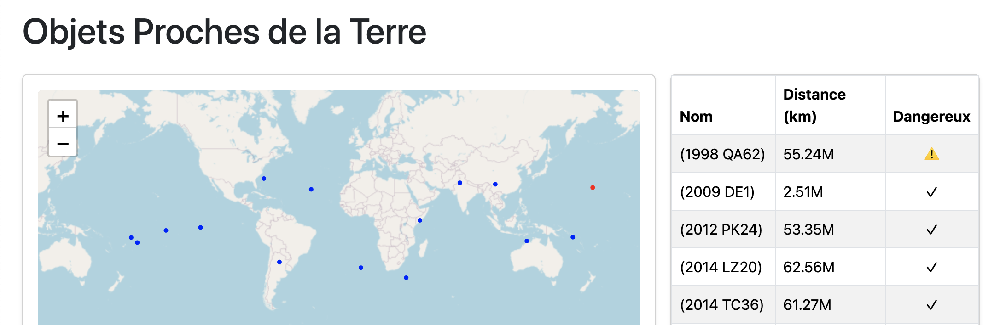

# NASA Near Earth Objects Tracker

A web application that displays Near Earth Objects (NEOs) using NASA's NeoWs API. The application shows potentially hazardous asteroids and their proximity to Earth through an interactive map and detailed information table.



## Technical Stack

- **Framework**: Next.js 14
- **Language**: TypeScript 5.2
- **Styling**: Bootstrap 5.3 & React-Bootstrap
- **Mapping**: React Leaflet
- **Data Visualization**: Custom Sky Map implementation
- **API Integration**: NASA NeoWs (Near Earth Object Web Service)

## Prerequisites

- Node.js (version 18.17 or higher)
- npm (version 9 or higher)
- A NASA API key (get one at https://api.nasa.gov)

## Installation

1. Clone the repository:
```bash
git clone https://github.com/yourusername/demo-nasa.git
cd demo-nasa
```

2. Install dependencies:
```bash
npm install
```

3. Create your environment file:
```bash
cp .env.example .env.local
```

4. Edit `.env.local` and add your NASA API key:
```bash
NEXT_PUBLIC_NASA_API_KEY=your_nasa_api_key_here
```

5. Start the development server:
```bash
npm run dev
```

6. Open [http://localhost:3000](http://localhost:3000) in your browser

## Features

- 🌍 Interactive Earth map showing NEO positions
- 📊 Real-time data from NASA's NeoWs API
- 🔍 Detailed information about each asteroid
- ⚠️ Visual indicators for potentially hazardous objects
- 📱 Responsive design for all device sizes

## Version History

### Version 1.0.0
- Initial release
- Earth map visualization
- NEO data table
- Basic responsive design

## Project Structure

```
demo-nasa/
├── src/
│   ├── components/     # React components
│   ├── hooks/         # Custom React hooks
│   ├── services/      # API services
│   ├── types/         # TypeScript definitions
│   └── pages/         # Next.js pages
├── public/            # Static assets
└── styles/           # Global styles
```

## Contributing

1. Fork the repository
2. Create your feature branch: `git checkout -b feature/my-new-feature`
3. Commit your changes: `git commit -am 'Add some feature'`
4. Push to the branch: `git push origin feature/my-new-feature`
5. Submit a pull request

## License

This project is licensed under the MIT License - see the [LICENSE](LICENSE) file for details.

## Acknowledgments

- NASA NeoWs API
- OpenStreetMap contributors
- React Leaflet team
